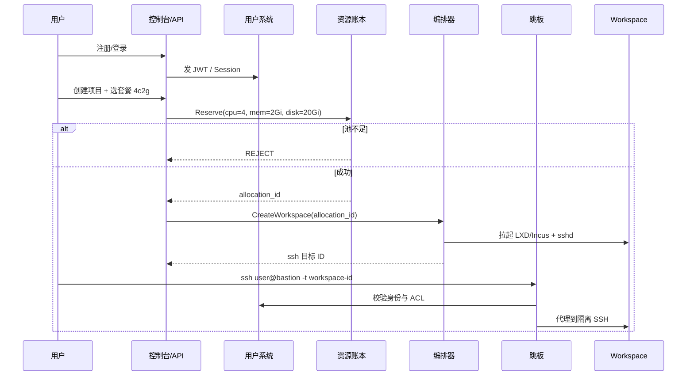

# ha-cluster 实施文档总览

> 仓库：`~/Projects/ha-cluster`  
> 起草：2026-09-06  
> 状态：**实施设计（相对 [prd.md](../prd.md) 的落地与扩展）**  
> 设备台账：[inventory.md](../inventory.md)

---

## 1. 文档目的

本目录把 PRD 从「要什么」推进到「怎么建」：技术选型、模块边界、接口、部署拓扑、验收标准与分阶段落地。

相对 PRD 第一期（Namespace + ResourceQuota），本实施文档**正式纳入**以下产品能力：

| 能力 | 一句话 |
|------|--------|
| 用户管理系统 | 注册/登录、角色、项目成员、审计 |
| 多用户协作 | 同项目多人、权限分级、共享工作区与密钥策略 |
| 隔离 SSH 环境 | 每工作区独立 SSH，互不可见进程/文件系统/网络命名空间 |
| 跳板机路由 | 统一 Bastion，按身份转发到目标工作区，不暴露 worker 公网 |
| 真机感操控 | 用户体验接近「一台可 root 的 Linux 虚机」，而不是只能 `kubectl apply` |
| **资源硬占用** | 已分配的 CPU/内存/磁盘从可售池中**扣减**，禁止二次售卖（见 [07](07-resource-ledger.md)） |
| 高可用部署 | 控制面与入口相对 worker 可存活；二期可双控制面 |
| **一包安装** | 一个 `ha-setup` / `.run`，输入 root 密码，amd64 与 arm64 都能加入（见 [10](10-fast-installer.md)） |
| **异构节点** | x86 Linux 主机与 ARM 手机/SBC **同为一等公民**（见 [11](11-node-profiles.md)） |
| **EasyTier 中枢** | 所有设备加入同一 overlay，随便放、不挑网络（见 [12](12-easytier.md)） |

PRD 仍有效；冲突时以本目录的「产品拍板」小节为准，并回写 PRD。

---

## 2. 产品拍板（相对 PRD 的增量）

### 2.1 「像虚拟机」不等于第一期上 KubeVirt

当前**库存**里 worker 以手机为主，但产品必须同时吃下 **x86_64 Linux 主机**。完整 KVM/KubeVirt 仍不适合作为手机主路径；在有 `/dev/kvm` 的 x86 上可作为 P3 套餐。

**采用的抽象：**

```
用户感知：一台「Project Workspace VM」
         ├── 独立 SSH（root 或 sudo）
         ├── 独立文件系统与软件包
         ├── 固定规格（如 2c1g / 4c2g）
         └── 生命周期：创建 / 启停 / 重建 / 销毁

底层实现（分阶段）：
  P1  LXD/Incus 系统容器（cgroup 硬限制）+ 可选 systemd
  P2  同规格可映射为 k3s Namespace 配额工作负载（CI/无状态）
  P3  有合适硬件时可选 Firecracker / KubeVirt 真微虚机
```

对用户 API/控制台只暴露 **Workspace**，不暴露「你其实是容器」。

### 2.2 资源必须硬占用（不可超分售卖）

> **硬约束：** 分配给用户的 CPU / 内存 / 磁盘，必须从全局可售池中**立即扣减**；未释放前不得再分配给其他用户或项目。  
> 管理员可单独开启「实验超售模式」，默认关闭；生产多租户路径**禁止**超售。

这与 PRD §6.2「CPU 可 200% 超售」冲突处：**默认策略改为不超售**；PRD 超售仅作单人自用调试开关。详见 [07-resource-ledger.md](07-resource-ledger.md)。

### 2.3 跳板是唯一 SSH 入口

公网不直接暴露各手机 `:22`。所有用户 SSH 走：

```
用户 → bastion.mnnumath.vip:22（或专用口）→ 按 ACL 路由到 workspace
```

底层：**Bastion 优先 EasyTier 虚 IP**；失败则 LAN / NPS 破窗。用户不可见拓扑。详见 [12](12-easytier.md) §3。

### 2.4 加节点 = 一个包 + root 密码

不为每类机器写一份「先 apt 再 curl k3s 再装 Incus」的手册。统一：

```
./ha-setup add-node --host <ip> --user root --role worker
# 输入该机 root 密码 → 推送对应架构 payload → 加入集群
```

或在目标机：`sudo ./ha-node-linux-<arch>-<ver>.run`。

快的关键是 **Depot（LAN/控制面制品库）+ 按架构离线 payload**，禁止每台机器现从 Docker Hub 零散下载。详见 [10-fast-installer.md](10-fast-installer.md)。

### 2.5 amd64 与 arm64 同为一等公民

手机是一类 worker（电池、NAT、小内存），不是唯一 worker。调度、镜像、账本池、安装器均按 `arch × power × class` 工作。开发机、闲置 PC、云主机都可以用同一安装器加入。详见 [11-node-profiles.md](11-node-profiles.md)。

### 2.6 EasyTier 是优选底盘，不是唯一生命线

为了「设备随便放」，用 EasyTier 当 **Fabric 的默认实现**：虚网 `10.88.0.0/16`，VPS 做中继（UDP/TCP/WSS）。

**但不把平台绑死在它上面：**

- 用户控制台 / 登录走 VPS **公网 443**，overlay 挂了网站还在。
- Workspace 是本机 Incus：网断 ≠ 删机，配额继续占用。
- ha-agent 心跳、Depot：EasyTier 优先，HTTPS 可降级。
- Bastion 进 Workspace：EasyTier → 同 LAN → NPS 破窗。
- 实现上预留 Fabric 接口，便于以后换 WG/第二中继。

详见 [12-easytier.md](12-easytier.md) §3.1。

---

## 3. 文档地图

| 文档 | 内容 |
|------|------|
| [00-index.md](00-index.md) | 本页：总览、拍板、术语、阶段 |
| [01-tech-selection.md](01-tech-selection.md) | 技术选型对比与决策 |
| [02-architecture.md](02-architecture.md) | 逻辑架构、组件、数据流 |
| [03-user-management.md](03-user-management.md) | 用户 / 角色 / 认证 / 审计 |
| [04-collaboration.md](04-collaboration.md) | 多用户协作、项目成员、共享策略 |
| [05-ssh-isolation.md](05-ssh-isolation.md) | 隔离 SSH 工作区设计 |
| [06-bastion-routing.md](06-bastion-routing.md) | 跳板机、路由、ACL、会话录制 |
| [07-resource-ledger.md](07-resource-ledger.md) | 资源账本、硬占用、套餐、防超卖 |
| [08-ha-deployment.md](08-ha-deployment.md) | 高可用拓扑、故障域、运维 |
| [09-roadmap.md](09-roadmap.md) | 里程碑、任务拆解、验收清单 |
| [10-fast-installer.md](10-fast-installer.md) | 一包安装、Depot、root 密码引导 |
| [11-node-profiles.md](11-node-profiles.md) | x86 / ARM 节点画像与调度 |
| [12-easytier.md](12-easytier.md) | EasyTier 公共中枢、虚 IP、与 NPS 分界 |
| [13-remaining-tasks.md](13-remaining-tasks.md) | **上线前 5 件运维任务**（控制面 / 虚网 / 制品 / Worker / 跳板） |
| [14-ui-and-qa-tasks.md](14-ui-and-qa-tasks.md) | **UI 五组 + 功能测试五组**（页面分工与用例） |
| [15-playwright-test-plan.md](15-playwright-test-plan.md) | **Playwright 本地 E2E**（五子任务 PW-1–PW-5、目录与用例） |
| [16-frontend-code-review.md](16-frontend-code-review.md) | **前端全量代码审查报告**（架构评估、分级问题清单与改进建议） |
| [17-api-and-config-review.md](17-api-and-config-review.md) | **前后端配置与接口对接审查报告**（全量接口契约矩阵、网络反代配置、大整数与异常流审查） |
| [18-frontend-dark-mode-review.md](18-frontend-dark-mode-review.md) | **前端暗色模式适配审查报告**（色彩Token规范度、WCAG对比度、原生控件暗色适配、多主题扩展架构） |
| [19-resource-allocation-ssh-and-ingress-design.md](19-resource-allocation-ssh-and-ingress-design.md) | **宿主机资源纳管、项目申请审批、SSH 极速信任与泛域名落地架构方案**（硬件探测预留、硬账本扣减、Bastion 路由、泛域名审批） |
| [20-architecture-review.md](20-architecture-review.md) | **整体方案合理性审查报告**（七大模块逐一审查、4 处代码-文档不一致、3 个阻塞上线缺口、P0/P1/P2 改进清单） |
| [21-core-pipeline-spec.md](21-core-pipeline-spec.md) | **核心链路闭环设计与工程规范**（ha-agent 远程编排协议、真实磁盘 Statfs 探测、Bastion 原生 SSH 协议实现、Ingress 审批流） |
| [22-project-machine-concepts.md](22-project-machine-concepts.md) | **项目、机器与用户概念梳理**（Project / Workspace / Node 分层、非 PVE 隔离、多管理员、申请与销毁审批、owner 转让） |
| [23-ingress-fabric-topology.md](23-ingress-fabric-topology.md) | **主节点、调度节点与 EasyTier 流量拓扑**（DNS 入主节点、入口只分流、Relay 经虚网转发算力节点） |
| [24-ssh-access-and-approval.md](24-ssh-access-and-approval.md) | **SSH 公钥、极速连接与连接权限审批**（用户设置公钥、Bastion 直达、管理员控权、无权限可申请、owner/admin 审批） |
| [25-ingress-portforward-dns.md](25-ingress-portforward-dns.md) | **反向代理、TCP 端口转发、公共/特殊域名、腾讯云与阿里云 DNS 快速配置** |
| [26-node-types-and-tags.md](26-node-types-and-tags.md) | **算力节点类型（cloud/self/customer）、备注与标签** |
| [27-project-monitoring-and-runtimes.md](27-project-monitoring-and-runtimes.md) | **项目机器监控与曲线、Docker+SSH / K8s 双运行时、创建时环境自动注入** |
| [28-depot-cdn-one-click-install.md](28-depot-cdn-one-click-install.md) | **离线 Depot、RustFS CDN（typora）、一键 install.sh 加节点** |

上游需求与库存：

- [prd.md](../prd.md) — 产品需求
- [inventory.md](../inventory.md) — 物理设备
- [../templates/project-large-4c2g.yaml](../../templates/project-large-4c2g.yaml) — 配额模板样例

---

## 4. 核心术语

| 术语 | 含义 |
|------|------|
| **Cluster** | 整套 ha-cluster：控制面 + worker + 入口 + 账本 |
| **Node** | 任意受支持 Linux 主机（VPS、x86 PC、SBC、手机…） |
| **Profile** | 节点画像：arch / power / class / tunnel |
| **Depot** | 按架构存放安装 payload 的制品库（LAN 加速） |
| **Payload** | 某一 `linux-amd64` 或 `linux-arm64` 的离线安装包 |
| **EasyTier / overlay** | 所有节点共享的虚拟网（公共中枢）；虚 IP 如 `10.88.0.0/16` |
| **Pool** | 某类可售资源集合（如 `amd64-mains`、`arm64-battery`） |
| **Plan / 套餐** | 预设规格，如 `large = 4c2g` |
| **Project** | 协作边界：成员、配额总预算、网络/域名策略 |
| **Workspace** | 可 SSH 的隔离环境（用户眼里的「虚机」） |
| **Allocation** | 账本中的一笔硬占用记录（占用中 / 已释放） |
| **Bastion** | 跳板：认证 + 路由 + 审计 |
| **Control Plane** | API、账本、用户、编排、k3s server 等常驻面 |

---

## 5. 目标用户旅程（端到端）



关键点：**先账本扣减，再创建环境**。创建失败必须回滚释放占用。

---

## 6. 实施阶段（摘要）

| 阶段 | 主题 | 详见 |
|------|------|------|
| **M0** | 文档与拍板（本目录） | [09](09-roadmap.md) |
| **M1** | 控制面 + EasyTier 中枢 + Depot + ha-setup 能从任意网络装节点 | |
| **M2** | 首个 Workspace（单用户、硬配额、经跳板 SSH） | |
| **M3** | 用户系统 + 项目成员协作 | |
| **M4** | 多 worker、迁移/重建、入口域名 | |
| **M5** | HA：etcd/DB 备份、双入口或热备方案 | |
| **M6** | 可选真微虚机、Web IDE、会话录制增强 | |

---

## 7. 非目标（实施层再次确认）

- 不做公有云计费出账（可预留计量字段）。
- 不做「手机当 etcd 节点」；x86 市电主机二期可以进控制面。
- 不做 qemu 翻译混跑异架构（默认关闭）。
- 不做默认「公网二层互通」；节点互访只承诺在 **EasyTier 虚网** 内。
- 不把集群流量再绑到 NPS 逐条隧道。
- 不把 VPS 80/443 交给 NPS / EasyTier。
- 不占用 NPS 8088–8097；EasyTier 用 **11010/11011**。
- 安装器密码与 EasyTier 网络密钥不进 Git。

---

## 8. 阅读顺序建议

1. 本页（拍板与术语）  
2. [01 技术选型](01-tech-selection.md) → [02 架构](02-architecture.md)  
3. [10 安装器](10-fast-installer.md) → [11 节点画像](11-node-profiles.md) → [12 EasyTier](12-easytier.md)  
4. [07 资源账本](07-resource-ledger.md)（硬占用是全系统约束）  
5. [03 用户](03-user-management.md) → [04 协作](04-collaboration.md)  
6. [05 SSH](05-ssh-isolation.md) → [06 跳板](06-bastion-routing.md)  
7. [08 HA](08-ha-deployment.md) → [09 路线图](09-roadmap.md) → [13 运维五事](13-remaining-tasks.md) → [14 UI/QA 分工](14-ui-and-qa-tasks.md) → [15 Playwright E2E](15-playwright-test-plan.md)
