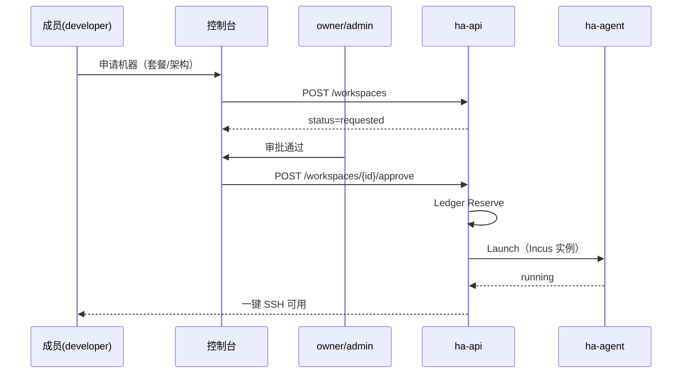

# 22 · 项目、机器与用户：产品概念梳理

> 上级索引：[00-index.md](00-index.md)  
> 关联：[03-user-management.md](03-user-management.md)、[04-collaboration.md](04-collaboration.md)、[07-resource-ledger.md](07-resource-ledger.md)、[19-resource-allocation-ssh-and-ingress-design.md](19-resource-allocation-ssh-and-ingress-design.md)、[23-ingress-fabric-topology.md](23-ingress-fabric-topology.md)、[24-ssh-access-and-approval.md](24-ssh-access-and-approval.md)、[27-project-monitoring-and-runtimes.md](27-project-monitoring-and-runtimes.md)  
> 文档性质：**产品概念定稿**（用户口述与工程术语的对齐稿）

---

## 1. 这份文档解决什么

用日常语言说清楚 ha-cluster 里三件事的关系：

1. **项目（Project）** — 多人协作的边界，管成员、管预算、管一批「机器」。
2. **机器（用户视角）** — 项目里申请到的一台可 SSH、可装软件、有独立磁盘的 Linux 环境。
3. **用户（User）** — 登录平台的人；在某个项目里扮演不同角色，决定谁能申请、谁能审批、谁能删机。

下文把用户口中的「机器」统一写成 **工作区（Workspace）**；物理主机写成 **节点（Node）**，避免和 PVE 虚拟机混淆。

---

## 2. 三层结构（一张图）

```
┌─────────────────────────────────────────────────────────────┐
│  平台（Platform）                                            │
│  · 平台最高管理员（platform_admin）：统一纳管节点/Depot/入口   │
│  · 可委派 platform_admin / platform_ops（见 29）             │
│  · 资源池（Pool）：amd64 / arm64 等可售算力                  │
└──────────────────────────────┬──────────────────────────────┘
                               │
         ┌─────────────────────┼─────────────────────┐
         ▼                     ▼                     ▼
   ┌───────────┐         ┌───────────┐         ┌───────────┐
   │ Project A │         │ Project B │         │ Project C │
   │ 成员 + 预算│         │ 成员 + 预算│         │ 成员 + 预算│
   └─────┬─────┘         └─────┬─────┘         └───────────┘
         │                     │
    ┌────┴────┐           ┌────┴────┐
    ▼         ▼           ▼         ▼
 Workspace  Workspace   Workspace  …
 （机器 1） （机器 2）  （机器 1）
```

**要点：**

- 一个项目可以有 **多台** 工作区（机器）。
- 每台工作区占用一笔 **Allocation（硬占用）**，从全局池里扣减 CPU / 内存 / 磁盘，未释放前不能二次售卖。
- 项目之间 **资源与文件系统互不可见**。

---

## 3. 「机器」是什么：不是 PVE，是 Incus 工作区

### 3.1 和用户直觉的对应

| 用户怎么说 | 平台术语 | 实际是什么 |
|------------|----------|------------|
| 申请一台机器 | 创建 / 申请 Workspace | 在某一 **Node** 上拉起一个隔离 Linux 环境 |
| 这台机器多大 | 套餐 Plan（如 2c2g、4c2g） | CPU 毫核 + 内存 + 磁盘配额 |
| 机器里的文件 | 独立文件系统 | Incus 实例专属根文件系统与数据卷 |
| 删机器 | 销毁 Workspace | 释放 Allocation，回收池容量 |

### 3.2  deliberately 不用 PVE

- **PVE** 只可作为实验室里模拟 Node 的测试手段（如 `ha-test-01` VM），**不是**用户工作区的运行时。
- 用户拿到的「机器」由 **`ha-agent` + Incus 系统容器** 在已纳管的 Node 上创建。
- Node 可以是：Linux 手机、闲置 PC、树莓派、腾讯云 VPS（作 worker）等；经 **EasyTier** 接入同一 Fabric，由控制面远程编排。

### 3.3 隔离保证什么

每台工作区具备：

| 维度 | 隔离方式 |
|------|----------|
| **文件系统** | 独立根文件系统；不与其他工作区共享 `/` 与 home（除非项目显式做共享卷，二期） |
| **CPU / 内存** | cgroup 硬限制（`limits.cpu`、`limits.memory`） |
| **磁盘** | 独立配额；Statfs 探测宿主机池，账本按申请量占用 |
| **进程 / 网络** | 独立 mount / PID / network namespace（Incus 默认） |
| **SSH** | 经 Bastion 按 ACL 路由；用户公钥注入该实例，不登录宿主机 |

用户感知接近「一台可 root 的 Linux 虚机」，底层是容器，**不是** KVM 整机。

---

## 4. 节点（Node）与工作区（Workspace）的区别

```
Node（宿主机）                    Workspace（项目里的「机器」）
─────────────────                ─────────────────────────────
物理或虚拟 Linux 主机              跑在 Node 上的隔离实例
由平台管理员 / ha-setup 纳管       由项目成员申请、管理员审批后创建
上报心跳、可售容量                 消耗 Allocation，有生命周期状态
一台 Node 可承载多个 Workspace     一个 Workspace 绑定一个 Node（一期）
```

纳管 Node ≠ 把 Node 整台交给某个项目。项目是 **按规格切片** 使用池子里的算力，而不是独占物理机。

---

## 5. 项目与用户

### 5.1 项目成员

每个项目有一组 **成员（Membership）**，每人一个 **项目角色**：

| 角色 | 日常能力（摘要） |
|------|------------------|
| **owner** | 项目创建者 / 最高负责人：改设置、管成员、**通过角色委派**审批权、可转让 owner |
| **admin** | 由 owner 指定，**可多名**；可审批创建/升配/降配/SSH 等 **项目级** 操作；**不能**终审销毁 |
| **developer** | 使用工作区（SSH）、提交申请；**不能**审批 |
| **viewer** | 只读用量与列表，不能 SSH、不能申请 |

**创建项目的用户** 自动成为该项目的 **owner**，拥有管理权。

**非成员不可见：** 未加入某项目的用户 **看不到** 该项目（列表无、直链 404）。邀请接受后才成为成员。

**成员 ≠ 能 SSH：** 进入项目后仍可能 `ssh_access=none`（须申请），或 `ssh_mode=read_only`（只能看文件不能改）。详见 [30-project-member-access.md](30-project-member-access.md)。

### 5.2 管理员可以多个

两层「管理员」并存，不互相替代：

| 层级 | 角色 | 管什么 |
|------|------|--------|
| **平台** | `platform_admin`（可多名，最高） / `platform_ops` | **统一**纳管 Node、Depot、入口、总池；`platform_admin` 可任命下级平台管理员 |
| **项目** | `owner` + 任意多名 `admin` | 成员与预算、**项目级**审批（创建/升配/降配/SSH）；**不能**加宿主机 Node；**不能**终审销毁 |

同一项目 **1 个 owner + N 个 admin**。owner 通过 **添加成员时下拉选角色** 或 **改角色** 把审批权分给同事（通常选 `admin`）。创建/升配/降配/SSH：**任一** `admin` 或 `owner` 可批；**销毁机器**须 **项目 admin 初审 + 平台超级管理员终审**（见 §6.4）。

**边界：** 用户说「加一台机器」须区分 — **加设备（Node）** 仅平台管理员（`curl install.sh \| join`）；**加项目机器（Workspace）** 走 §6 申请审批。详见 [29-platform-admin-governance.md](29-platform-admin-governance.md)。

### 5.3 所有权转移（移交管理权）

指 **项目 owner** 的变更，不是单台工作区的「过户」：

```
现 owner（或 platform_admin）
  → 控制台「转让项目负责人」→ 选择项目中另一名成员
  → POST /projects/{id}/transfer-ownership { new_owner_user_id }
  → 审计记录 + 通知双方
```

规则：

- 仅 **现 owner** 或 **platform_admin** 可发起转让。
- 受让人 **须已是项目成员**（下拉只列当前成员）。
- 转让后 **新 owner** 获得全部项目负责人权限。
- 转让后 **原 owner 降为普通成员 `developer`**（失去管理权，不再能审批、改设置、管成员）；若仍需协作审批，须新 owner 将其 **改回 `admin`**。
- 工作区、Allocation、成员关系 **不重置**；账本仍挂在同一 Project 下。

（工作区级 `OwnerUserID` 表示「谁申请的 / 私有机归属」，与项目 owner 不同；见 [04-collaboration.md](04-collaboration.md)。）

### 5.4 添加成员与角色委派（同事场景）

团队内多为同事，添加成员 **不用复杂邮件流** 作为主路径：

```
owner / admin → 成员页「添加成员」
  → 搜索/选择已有平台用户（同公司账号）
  → 角色下拉：admin | developer | viewer
  → 确认 → membership 立即生效
```

- **审批权委派**：把同事设为 **`admin`** 即可让其审批创建机器、升配、降配、SSH 连接权等 **项目级** 事项。
- **不能** 通过项目角色授予「销毁终审权」或「纳管 Node」；后者属平台超级管理员（见 [29](29-platform-admin-governance.md)）。
- 邮件邀请仍保留，用于 **尚未注册** 的外部协作者（次要路径）。

---

## 6. 审批工作流（申请、扩容与销毁）

**产品拍板：** **申请新机器**、**升配**、**降配** 均须 **项目管理员（owner / admin）同意** 后才会改规格或占资源。普通成员只能提交申请，不能绕过审批。

| 操作 | 谁可发起 | 是否须管理员审批 | 审批前占资源？ |
|------|----------|------------------|----------------|
| **申请新机器** | `developer+` | **是**（owner/admin 直建可免审） | 否，仅校验预算 |
| **升配（扩容）** | `developer+`（私有机须本人或 admin） | **是**（一律 pending） | 否，仅校验增量预算 |
| **降配（缩容）** | `developer+`（私有机须本人或 admin） | **是**（一律 pending） | 否；通过后 **释放** 差额配额 |
| **销毁机器** | `developer+` | **是**：项目 admin 初审 + **平台超级管理员终审**（§6.4） | 终审通过后才释放 |

**项目级**审批人（创建/升配/降配/SSH）：**owner 或任意 admin**。  
**危险操作**（销毁等）：项目 admin 通过后进入 **平台待审队列**，须 **超级管理员**（或已委派的平台审批角色）终审。

### 6.1 申请机器（创建工作区）

```
developer 发起申请（选择套餐、架构、名称）
  → Workspace 状态：requested
  → 项目 owner / admin 审批
       ├─ 通过 → 账本 Reserve → 选 Node → ha-agent Launch → running
       │         → 控制台展示「一键 SSH」（见 §7）
       └─ 驳回 → rejected（不占池、不起实例）
```

- **`viewer` 不能申请机器**（只读角色）；须先被提升为 `developer` 或具备相应权限。
- **`owner` / `admin` 在控制台直建**：可 **免审**，立即 Reserve + Provisioning（便于管理员自用排障）。
- 审批前只做 **项目预算校验**，**不扣**全局池；**审批通过后**才硬占用并 **自动安装** 工作区（用户无需 SSH 进宿主机手工装环境）。



### 6.2 变更规格（升配 / 降配）— 均须管理员同意

升配与降配共用 **`resize pending`** 审批流；成员 **不能** 自行改 cgroup 或私自释放配额。

#### 升配（扩容）

```
成员提交升配（如 2c2g → 4c4g）
  → resize_status = pending，resize_kind = upgrade（建议字段）
  → owner / admin 审批
       ├─ 通过 → Ledger Expand → ha-agent Resize → 规格生效
       └─ 驳回 → 清除 pending，保持原规格
```

- 审批须校验 **项目预算** 与 **节点剩余容量**；不足则驳回。

#### 降配（缩容）

```
成员提交降配（如 4c4g → 2c2g）
  → resize_status = pending，resize_kind = downgrade（建议字段）
  → owner / admin 审批
       ├─ 通过 → Ledger Shrink（释放差额）→ ha-agent Resize → 规格生效
       └─ 驳回 → 清除 pending，保持原规格
```

- **降配同样必须申请**，与升配对称；不允许成员在控制台或 API **直接缩容**。
- **磁盘降配**：目标 `disk_bytes` 不得低于实例 **已用数据量**（agent Statfs / 卷用量校验）；不满足则驳回并提示先清理数据。
- **CPU / 内存降配**：须在工作区 `running` 或 `stopped` 下执行；Incus 缩容后 cgroup 立即生效。
- 降配通过后，释放的 CPU/内存/磁盘回到 **节点池与项目预算**（硬账本 `Allocation` 减量）。

#### 共用规则

- **所有成员**（含 `developer`）发起升配或降配后均 **pending**，不即时生效。
- **owner / admin** 发起同样走 pending，由 **任一** owner/admin 批准（单人项目可自批）。
- 同一工作区 **不允许** 并行两笔 resize 待办（已有 pending 时返回冲突）。

| API | 说明 |
|-----|------|
| `POST /workspaces/{id}/resize` | 提交升配或降配申请（目标规格） |
| `POST /workspaces/{id}/resize/approve` | owner/admin 批准 |
| `POST /workspaces/{id}/resize/reject` | owner/admin 驳回 |

> **实现状态：** **升配** 审批已实现（`RequestResize` / `ApproveResize`）。当前代码对降配返回 `ErrNotExpansion` / `ErrDiskShrink`，**须按本节放开降配路径并叠加审批**；建议增加 `resize_kind` 与 `Ledger.Shrink`。

### 6.4 删除 / 销毁机器（危险操作）— 双层审批

**产品规则（本文拍板）：**

> 销毁工作区属于 **危险操作**。成员可 **发起申请**；须 **项目 admin/owner 初审** 通过后，再经 **平台超级管理员（或已委派的平台审批角色）终审** 才真正删机释池。  
> `platform_admin` 可紧急强制销毁（审计必记，绕过队列须留痕）。

```
申请人（developer+）提交销毁
  → destroy_requested
  → 项目 owner / admin 初审
       ├─ 驳回 → 回到 running / stopped
       └─ 通过 → destroy_pending_platform（进入平台待审）

平台超级管理员（或委派角色，见 29 §8）
  → 终审通过 → destroying → agent Destroy → Ledger Release → destroyed
  → 终审驳回 → destroy_rejected（通知项目；实例保留）
```

| 阶段 | 审批人 | 控制台入口 |
|------|--------|------------|
| 发起 | `developer+` | 工作区「申请销毁」 |
| 初审 | 项目 `owner` / `admin` | 项目「待审批」 |
| **终审** | **`platform_admin`**（或平台委派角色） | 平台「危险操作待审」 |

与 **创建** 不同：创建/升配/降配 **项目 admin 一批即生效**；**销毁必须平台终审**，防止同事误删或越权释池。

> **实现状态：** 创建侧审批已落地。销毁须新增 `destroy_requested` → `ApproveDestroyProject` → `ApproveDestroyPlatform`；当前代码直删行为 **以本文为准** 改造。

---

## 7. 一行命令：快速安装

平台里有两类「安装」，都不要用户手工 apt / docker / 配网络。

### 7.1 算力节点纳管（给集群加宿主机）

在新 Linux 机器上执行 **一行命令** 即可加入 EasyTier 并成为可调度 **Node**（详见 [10-fast-installer.md](10-fast-installer.md)）：

```bash
curl -fsSL https://rustfs.s.ggss.club:50000/typora/ha-cluster/install.sh \
  | sudo bash -s join --token 'ha://join/<cluster>/<secret>?depot_public=https://rustfs.s.ggss.club:50000/typora/ha-cluster'
```

详见 [28-depot-cdn-one-click-install.md](28-depot-cdn-one-click-install.md)；RustFS 凭据仅 [credentials.local.md](../credentials.local.md)。

或管理端远程推送（`ha-setup add-node`）等价于上述流程。装完后 `ha-agent` 上报容量，该节点才可被用来承载工作区。

| 步骤 | 谁做 | 结果 |
|------|------|------|
| 生成 join token | **`platform_admin` 仅** | 一次性令牌含 ET 网络与 Depot 地址 |
| 目标机执行一行 curl | **`platform_admin`（或授权运维代执行）** | EasyTier 入网 + k3s agent + Incus + ha-agent |
| 设置类型/标签 | `platform_admin` / `platform_ops` | `machine_type`、`remark`、`tags` |
| 控制台 Node Ready | 自动 | 进入全局算力池，供各项目 Workspace 调度 |

项目成员 **不** 持有 join token，也 **不** 在宿主机上自行执行纳管脚本。

### 7.2 项目机器（工作区）— 审批后自动装好

用户 **不**在宿主机上执行安装命令。流程是：

```
成员申请机器 → 管理员审批通过
  → 控制面自动：Reserve → Launch（Incus + 镜像 + 配额 + 注入 SSH 公钥）
  → 状态 running
  → 成员复制「一行 SSH」立刻登录
```

控制台提供的 **一行连接命令**（示例）：

```bash
ssh alice@bastion.example.com -p 8099 -t <workspace-uuid>
```

前提：用户已在个人设置添加 SSH 公钥，且具备 SSH 连接权（见 [24-ssh-access-and-approval.md](24-ssh-access-and-approval.md)）。

**总结：**

| 对象 | 「一行命令」指什么 |
|------|-------------------|
| **宿主机 Node** | `curl … \| sudo bash -s join --token …`（纳管进集群） |
| **项目 Workspace** | 审批后平台 **自动安装**；用户用 **一行 `ssh …`** 进入 |

---

## 8. 端到端故事（核对用）

1. Alice **创建项目** `homework`，成为 **owner**。
2. Alice **邀请** Bob 为 **developer**，Carol 为 **admin**（项目内第二管理员）。
3. Bob **申请**一台 2c2g arm64 **机器** → 状态 `requested`。
4. Carol **审批通过** → 系统自动 Launch → Bob 复制 **一行 SSH** 进入。
5. Bob **申请升配**到 4c4g → `resize pending` → Carol **批准** → 规格生效。
6. Bob **申请降配**回 2c2g → 同样 pending → Carol **批准** → 差额配额回池。
7. Bob 再 **申请**第二台机器 → 同一项目下 **多台** Workspace 并存。
8. Bob **申请删除**第一台机器 → Carol **项目初审**通过 → **平台超级管理员终审**后配额回池。
9. Alice **将 owner 转让给** Carol → Alice **降为 developer**；Carol 成为 owner，项目与机器不变。
10. 若 Node 离线，工作区可能 `node_lost`；**不自动删机**，占用保留。

---

## 9. 与工程对象、API 的映射

| 概念 | 模型 / API | 说明 |
|------|------------|------|
| 项目 | `Project`, `POST /projects` | `owner_id` 指向创建者 |
| 成员 | `Membership` | `role`: owner / admin / developer / viewer |
| 机器（用户） | `Workspace` | `POST /projects/{id}/workspaces` |
| 申请创建 | `status=requested` | `ApproveWorkspace` / `RejectWorkspace` |
| 升配 / 降配 | `resize_status=pending` + `resize_kind` | `POST …/resize` → `…/resize/approve`（升配与降配均已实现） |
| 申请销毁 | `destroy_requested` → `destroy_pending_platform` | `POST …/destroy-request` → `…/destroy-request/approve` → `POST /admin/dangerous-approvals/{id}/approve` |
| 节点一行安装 | `ha-setup join` / curl install.sh | 见 [10-fast-installer.md](10-fast-installer.md) |
| 硬占用 | `Allocation` + `Ledger` | `reserved` → `active` → `released` |
| 宿主机 | `Node` + `ha-agent` 心跳 | 不对项目成员直接暴露 SSH |
| 独立磁盘 | Incus volume + `disk_bytes` | agent `Launch` / `resize` |
| 转让 owner | `POST .../transfer-ownership` | 见 [03-user-management.md](03-user-management.md) |

---

## 10. 明确不做 / 易混淆点

| 误解 | 正解 |
|------|------|
| 一台 PVE VM = 用户的一台机器 | PVE 仅测试用；用户机器 = Incus Workspace |
| 申请机器 = 独占整台物理机 | 按套餐切片；一 Node 可多 Workspace |
| 删项目成员 = 自动删他的机器 | 移除成员 ≠ 销毁工作区；需单独走销毁审批 |
| 只有一个管理员 | 项目可多名 `admin`；另有平台 `platform_admin` |
| developer 能直接删机 | **产品定稿：不能**；须项目 admin 初审 + **平台超级管理员终审** |
| developer 能直接升配/降配 | **不能**，须提交申请并由 admin `ApproveResize` |
| 用户要自己装 Workspace | **不用**；审批后平台自动 Launch |

---

## 11. 文档关系

- 协作细节（共享机 / 私有机）：[04-collaboration.md](04-collaboration.md)  
- 角色权限表：[03-user-management.md](03-user-management.md)  
- 账本与防超卖：[07-resource-ledger.md](07-resource-ledger.md)  
- 审批与 Ingress 闭环：[19-resource-allocation-ssh-and-ingress-design.md](19-resource-allocation-ssh-and-ingress-design.md)、[21-core-pipeline-spec.md](21-core-pipeline-spec.md)  
- SSH 公钥与连接权审批：[24-ssh-access-and-approval.md](24-ssh-access-and-approval.md)  

**冲突时：** 本文 §6.3（销毁须审批）与当前 `DestroyWorkspace` 直删行为冲突，**以本文产品定稿为准**，实施时改代码与 E2E。

---

## 12. 监控与运行环境（摘要）

- 项目内可查看 **全部机器** 的 CPU / 内存 / 磁盘状态与 **近期曲线**（见 [27-project-monitoring-and-runtimes.md](27-project-monitoring-and-runtimes.md)）。
- 两种运行环境：**Docker + SSH**（`container`，默认）与 **Kubernetes**（`k8s`）；创建时自动注入 Docker、SSH 公钥或 k8s Namespace/Quota。

---

## 13. SSH 连接（摘要）

- 用户在 **个人设置** 添加 SSH 公钥；工作区就绪后 **经 Bastion 立刻连接**（见 [24-ssh-access-and-approval.md](24-ssh-access-and-approval.md)）。
- **项目创建人 / admin** 控制谁有 SSH 连接权；无权限者可 **申请**，owner/admin **审批**。
- `viewer` 默认不可 SSH；`developer` 是否自动开通可由项目策略配置。

---

## 14. 验收清单（概念落地）

- [ ] 项目内可存在 ≥2 台运行中 Workspace，配额分别占用  
- [ ] developer 申请机器 → `requested`，admin 审批后才 `running` 且自动 Launch  
- [ ] developer 申请升配 / 降配 → `resize pending`，admin 审批后才生效（降配释放差额配额）  
- [ ] developer 销毁 → 项目 admin 初审 → 平台超级管理员终审后才 `destroyed` 且池回收
- [ ] owner 转让后原 owner 降为 `developer`，无管理菜单  
- [ ] 新 Node 一行 `curl … join` 入网后可被调度承载 Workspace  
- [ ] 工作区 running 后控制台提供一行 SSH 命令可复制  
- [ ] 每台 Workspace SSH 后文件系统互不可见（抽检 `df` / 写标记文件）  
- [ ] 项目至少 2 名 `admin` 均可审批创建；销毁仅初审，终审在平台队列
- [ ] 添加成员：搜索用户 + 角色下拉（admin/developer/viewer）立即生效  
- [ ] owner 转让后新 owner 可管理成员与审批，审计有记录  
- [ ] viewer 申请 SSH 连接权 → owner/admin 审批后可经 Bastion 立刻连接（见 [24](24-ssh-access-and-approval.md)）  
- [ ] 运行时栈为 Incus（非 PVE 模板机）；PVE 仅作 Node 仿真测试可选  
