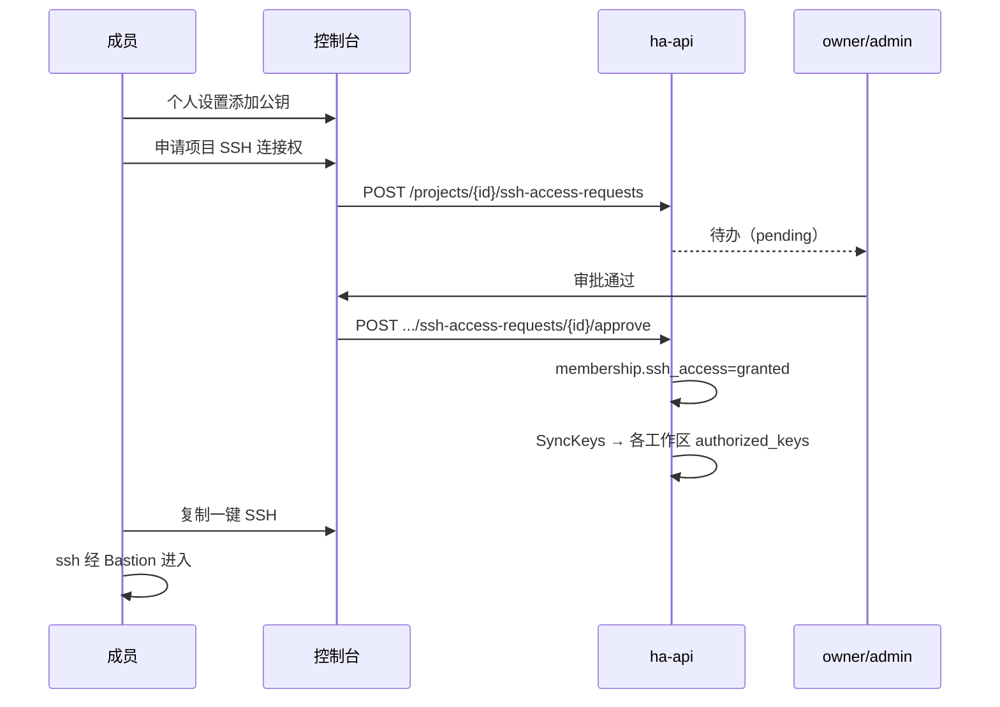

# 24 · SSH 公钥、极速连接与连接权限审批

> 上级索引：[00-index.md](00-index.md)  
> 关联：[03-user-management.md](03-user-management.md)、[04-collaboration.md](04-collaboration.md)、[05-ssh-isolation.md](05-ssh-isolation.md)、[06-bastion-routing.md](06-bastion-routing.md)、[22-project-machine-concepts.md](22-project-machine-concepts.md)  
> 文档性质：**产品概念定稿**（SSH 体验 + 谁可以连 + 申请审批）

---

## 1. 目标体验（一句话）

用户在 **个人设置里添加一次 SSH 公钥**；机器审批通过并处于运行中后，**立刻**经跳板 SSH 进入项目工作区——**无需**手动配端口、记 worker IP。  
**谁能连** 由项目管理员（创建人 / admin）控制；没有权限的成员可 **申请**，由 **项目创建人（owner）或 admin 审批** 通过后开通。

---

## 2. 用户侧：从注册到连上（极速路径）

```
① 登录控制台
② 个人设置 → SSH 公钥 → 添加公钥（笔记本 / CI 可多把）
③ 进入项目 → 工作区列表 → 复制「一键 SSH」或下载 ssh-config
④ 终端执行 ssh … → 经 Bastion → EasyTier → 工作区 shell
```

### 2.1 公钥管理（用户设置）

| 项 | 说明 |
|----|------|
| 入口 | 控制台 **个人设置 → SSH 公钥**（`GET/POST/DELETE /me/ssh-keys`） |
| 格式 | OpenSSH 一行：`ssh-ed25519 AAAA… comment` |
| 校验 | 解析失败拒绝；指纹 SHA256 展示，防重复 |
| 数量 | 每用户多把（笔记本 + CI 等） |
| 生效 | 写入 DB 后 **热同步** 到该用户有权访问的工作区 `authorized_keys`（秒级，无需重启机器） |

**前提：** 平台账号 `active`；用户至少登记 **一把** 公钥，否则 Bastion 握手失败（`AuthorizedKeysCommand` 返回空）。

### 2.2 连接方式（工作区卡片）

机器 `running` 且用户 **具备 SSH 连接权** 时，控制台提供：

| 能力 | API / 展示 |
|------|------------|
| 一键命令 | `GET /workspaces/{id}/ssh-connection` |
| ssh-config 片段 | `GET /workspaces/{id}/ssh-config` |
| 主机密钥指纹 | `fingerprint` 字段（用户只信 Bastion；后端到容器钉扎 host key） |

示例（以实际环境域名为准）：

```bash
ssh alice@bastion.example.com -p 8099 -t <workspace-uuid>
```

用户 **只记 Bastion 地址**；工作区落在哪台算力节点、EasyTier 虚 IP 多少，由控制面在跳板鉴权后自动路由（见 [06-bastion-routing.md](06-bastion-routing.md)）。

### 2.3 「立刻连接」的条件（同时满足）

| # | 条件 |
|---|------|
| 1 | 用户已添加 SSH 公钥 |
| 2 | 用户在该项目的 **SSH 连接权 = 已授予**（见 §3） |
| 3 | 工作区状态 `running`（或支持唤醒的 `suspended` 等策略状态） |
| 4 | 工作区 **可见性 ACL** 允许该用户（共享机 / 私有机规则，见 §3.3） |
| 5 | 目标节点 overlay 可达（不可达时提示 `fabric_degraded`，不删机） |

机器尚在 `requested` / 未审批通过时，**不允许 SSH**（公钥也不会注入未完成创建的实例）。

---

## 3. 谁能连：权限模型

SSH 权限分 **三层**，都通过才允许会话：

```
允许 SSH  ⟺  用户是该项目成员（非成员连项目都看不到，见 30）
           AND  项目层 SSH 连接权 ssh_access=granted
           AND  ssh_mode 决定只读/读写 Shell
           AND  工作区层可见性 ACL
           AND  工作区已 running
```

### 3.1 项目层：SSH 连接权（管理员控制）

每个 **项目成员** 有一条 **SSH 连接权** 状态（挂在 `Membership` 上，或等价扩展表）：

| 状态 | 含义 | 能否 SSH |
|------|------|----------|
| `granted` | 已授予 | 在满足工作区 ACL 的前提下可以 |
| `none` | 未授予（默认，如 `viewer` 或新加入成员） | 不可以 |
| `pending` | 已提交申请，待审批 | 不可以 |
| `revoked` | 管理员撤销 | 不可以 |

### 3.1.1 SSH 模式（`ssh_mode`，仅 `granted` 时）

| 值 | 含义 |
|----|------|
| `read_write` | 默认；正常 shell，可修改工作区文件 |
| `read_only` | 可 SSH 查看文件，**不可** 修改工作区文件、不可 `sudo` |

管理员授予或审批时可指定 `ssh_mode`（例如观察员只读）。详见 [30-project-member-access.md](30-project-member-access.md) §5。

**谁可以授予 / 撤销 / 审批：**

| 操作 | owner | admin | developer | viewer |
|------|-------|-------|-----------|--------|
| 直接授予他人 SSH 权 | ✓ | ✓ | ✗ | ✗ |
| 撤销他人 SSH 权 | ✓ | ✓ | ✗ | ✗ |
| 审批 SSH 申请 | ✓ | ✓ | ✗ | ✗ |
| 自己申请 SSH 权 | 若尚未 granted | 同左 | 若被撤销后可再申请 | ✓ |

> **产品拍板：** 项目 **创建人（owner）** 与 **admin** 均可审批；创建人转让 owner 后，新 owner 继承审批权。

**与项目角色的关系（推荐默认策略）：**

| 邀请角色 | SSH 连接权初始值 | 说明 |
|----------|------------------|------|
| `owner` / `admin` | `granted` | 管理者默认可连，便于排障 |
| `developer` | **可配置** | 策略 A：`granted`（信任邀请即授权）；策略 B：`none`（须管理员显式开） |
| `viewer` | `none` | 只读，不可 SSH；须 **申请** |

平台级 `platform_admin` 可 SSH 到任意工作区（审计必记），用于运维破窗。

### 3.2 申请与审批流（无权限用户）

```
成员（通常 viewer，或被撤销的 developer）
  → 项目页「申请 SSH 连接权」
  → Membership.ssh_access = pending
  → 通知 owner / admin

owner 或 admin
  → 审批通过 → ssh_access = granted
            → 热同步公钥到其可访问的共享工作区
  → 驳回 → ssh_access = none，附原因

成员
  → 工作区卡片出现 SSH 入口，可立刻连接
```



### 3.3 工作区层：可见性 ACL（在 SSH 连接权之上）

即使项目层 `granted`，仍受 **单台工作区** 规则约束（与现网 ACL 一致，见 [06-bastion-routing.md](06-bastion-routing.md) §6）：

| 工作区类型 | 额外条件 |
|------------|----------|
| **shared**（项目共享） | 项目 SSH `granted` + 角色 ≥ developer **或** 已单独授予 SSH 的成员 |
| **private**（个人私有） | 仅 **工作区 OwnerUserID** 本人，或项目 **owner / admin** |

`viewer` 即使将来升为 `granted`，对 **private** 工作区仍不可进（除非 admin 代管）。

---

## 4. 公钥如何进机器（零手工）

```
用户添加/更新公钥（/me/ssh-keys）
        │
        ▼
控制面计算：该用户 ssh_access=granted 的项目
        │         ∩ 有权访问的工作区列表
        ▼
对每个工作区 → ha-agent POST /v1/workspaces/sync-keys
        │
        ▼
Incus 容器 /root/.ssh/authorized_keys 覆写
```

**创建工作区时（Launch）：** 一次性注入当时 **有权进入该工作区** 的所有成员公钥（共享机 = 项目内 `granted` 且 developer+ 的成员；私有机 = 创建者公钥）。

**审批 SSH 通过后：** 立即对该项目下已有 **shared** 工作区执行 `sync-keys`，用户 **无需等待重建**。

---

## 5. 管理员控制台能力

| 功能 | 说明 |
|------|------|
| 成员列表展示 SSH 状态 | `granted` / `none` / `pending` / `revoked` |
| 一键授予 / 撤销 | 撤销后 Bastion 下一连接即拒；已注入公钥从容器移除 |
| 待审批队列 | 与「申请机器」并列；owner/admin 处理 SSH 连接权申请 |
| 审计 | `ssh.access.grant` / `ssh.access.revoke` / `ssh.access.request` / `ssh.allow` / `ssh.deny` |

移除项目成员时：**立即** 撤销 SSH 权、从所有相关工作区 `authorized_keys` 删除其公钥。

---

## 6. 与 Bastion 的衔接

```
用户 ssh → Bastion（公网）
  → AuthorizedKeysCommand → GET /internal/authorized-keys?user=
       （校验公钥属于该用户）
  → ForceCommand / ha-bastion-proxy
  → GET /internal/ssh-target?user=&id=<workspace-uuid>
       （校验 ssh_access=granted + 工作区 ACL + running）
  → Dial worker fabric_ip:ssh_port（EasyTier）
  → 容器 sshd
```

拒绝时写审计 `ssh.deny`；成功写 `ssh.allow`（现有 `extra.go` 行为保留）。

---

## 7. 数据模型（建议扩展）

在 `memberships` 表增加（或独立 `ssh_access_grants`）：

| 字段 | 类型 | 说明 |
|------|------|------|
| `ssh_access` | enum | `none` \| `pending` \| `granted` \| `revoked` |
| `ssh_mode` | enum | `read_write` \| `read_only`（默认 `read_write`） |
| `ssh_access_requested_at` | timestamp | 申请时间 |
| `ssh_access_reviewed_by` | uuid | 审批人 |
| `ssh_access_reviewed_at` | timestamp | |
| `ssh_access_reject_reason` | text | 驳回原因 |

可选表 `ssh_access_requests`（保留多次申请历史）：

| 字段 | 说明 |
|------|------|
| id, project_id, user_id | |
| status | pending / approved / rejected |
| reason, reviewed_by, reviewed_at | |

---

## 8. API 契约（建议）

| 方法 | 路径 | 权限 | 说明 |
|------|------|------|------|
| GET | `/me/ssh-keys` | 本人 | 已有 |
| POST | `/me/ssh-keys` | 本人 | 已有 |
| DELETE | `/me/ssh-keys/{id}` | 本人 | 已有 |
| POST | `/projects/{id}/ssh-access-requests` | 项目成员 | 提交申请（自身） |
| GET | `/projects/{id}/ssh-access-requests` | owner/admin | 待办列表 |
| POST | `/projects/{id}/ssh-access-requests/{rid}/approve` | owner/admin | 通过 |
| POST | `/projects/{id}/ssh-access-requests/{rid}/reject` | owner/admin | 驳回 |
| PUT | `/projects/{id}/members/{uid}/ssh-access` | owner/admin | 直接 grant/revoke + `ssh_mode` |
| GET | `/workspaces/{id}/ssh-config` | granted + ACL | 已有 |
| GET | `/workspaces/{id}/ssh-connection` | granted + ACL | 已有 |

`SSHTarget` / `internal/ssh-target` 在鉴权链中增加 **`membership.ssh_access == granted`**（`owner`/`admin`/`platform_admin` 豁免）。

---

## 9. 与现有实现的关系

| 能力 | 现状 | 本文拍板后 |
|------|------|------------|
| 用户设置添加公钥 | ✓ `SSHKeys.tsx` + `/me/ssh-keys` | 保持 |
| 公钥注入 / 热同步 | ✓ agent `sync-keys` | 保持；审批通过后触发同步 |
| 下载 ssh-config | ✓ `WorkspaceRow` | 保持 |
| 角色 developer+ 可 SSH | ✓ `CanSSH` + `SSHTarget` | **叠加** `ssh_access=granted` |
| viewer 申请 SSH 权 | ✗ | **待实现** §3.2、§8 |
| owner 审批 SSH 申请 | ✗ | **待实现** |
| admin 直接授予/撤销 | ✗ | **待实现** |

当前测试已覆盖：未审批的工作区不可 SSH（`TestDeveloperRequestNeedsApproval`）；私有机 ACL（`TestPrivateWorkspaceSSHACL`）。  
待补充：`viewer` 申请 → owner 批准 → 可 SSH；`revoked` 后 Bastion 拒绝。

---

## 10. 验收清单

- [ ] 用户在个人设置添加公钥后，控制台展示指纹  
- [ ] 工作区 `running` + 用户 `ssh_access=granted` → 一键 SSH 可用，10 秒内进入 shell  
- [ ] `viewer` 无 SSH 权 → Bastion 拒绝 + 控制台可申请  
- [ ] owner 审批通过 → 无需重建工作区即可 SSH  
- [ ] admin 撤销后 → 下一 SSH 会话失败；公钥从容器移除  
- [ ] 私有机：非 owner/admin 的 granted 成员仍不可进  
- [ ] 审计可查到 grant / revoke / allow / deny  

---

## 11. 文档关系

- 隔离与生命周期：[05-ssh-isolation.md](05-ssh-isolation.md)  
- 跳板路由与 ACL 公式：[06-bastion-routing.md](06-bastion-routing.md)  
- 公钥注入工程细节：[19-resource-allocation-ssh-and-ingress-design.md](19-resource-allocation-ssh-and-ingress-design.md) §4  
- Bastion 协议实现：[21-core-pipeline-spec.md](21-core-pipeline-spec.md) §4  
- 项目成员与角色：[22-project-machine-concepts.md](22-project-machine-concepts.md)  
