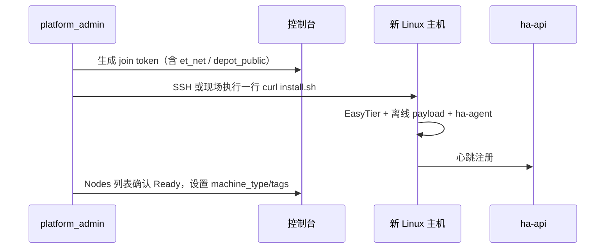

# 29 · 平台最高管理员与基础设施治理

> 上级索引：[00-index.md](00-index.md)  
> 关联：[03-user-management.md](03-user-management.md)、[22-project-machine-concepts.md](22-project-machine-concepts.md)、[28-depot-cdn-one-click-install.md](28-depot-cdn-one-click-install.md)  
> 文档性质：**平台级资源归属与委派定稿**

---

## 1. 原则

**所有平台基础设施资源** — 算力宿主机、Depot/CDN 制品、join token、入口/Relay、全局池与套餐 — **统一由平台最高管理员（`platform_admin`）添加与配置**。

普通项目成员（含项目 `owner` / `admin`）**只能**在本项目内申请/审批 **Workspace（机器）**，**不能**自行纳管宿主机、上传 Depot 或改入口拓扑。

---

## 2. 角色层级

```
平台最高管理员（platform_admin，可多名）
  ├─ 可任命 / 撤销：platform_admin、platform_ops
  ├─ 可配置：节点、Depot、Ingress 入口、全局池、套餐、跨项目强制操作
  └─ 种子账号：部署时创建的 admin（见 inventory / credentials.local）

平台运维（platform_ops，可多名）
  ├─ 由 platform_admin 任命
  ├─ 节点维护：排空、封锁、查看容量与审计
  └─ 不可改计费、不可任命平台管理员

项目 owner / admin（每个 Project 内，可多名）
  ├─ 管本项目成员（添加同事时下拉选角色）、预算、创建/升配/降配/SSH **项目级**审批
  ├─ 销毁机器：仅 **初审**；**终审**须平台超级管理员（或 §8 委派角色）
  └─ 不能纳管 Node、不能发 join token、不能上传 Depot

项目 developer / viewer
  └─ 使用已审批的工作区；viewer 只读
```

**两层管理员不互相替代：** 项目 `admin` ≠ 平台 `platform_admin`。加一台 **设备（宿主机 Node）** 是平台动作，不是项目动作。

---

## 3. 平台管理员统一管理的资源

| 资源 | 操作方式 | 谁可做 |
|------|----------|--------|
| **纳管宿主机 Node** | 控制台生成 join token → 目标机执行 `curl install.sh \| join`（或 `ha-setup add-node`） | `platform_admin`；`platform_ops` 仅维护已纳管节点 |
| **Depot / CDN 制品** | `pack.sh` + `upload-depot-s3.py` 上传至 RustFS | `platform_admin` |
| **节点元数据** | `machine_type`、`remark`、`tags` | `platform_admin` / `platform_ops` |
| **入口 / Relay / 域名策略** | 入口机 Nginx、Relay 池、Ingress 审批策略 | `platform_admin` |
| **全局资源池与套餐** | Pool、Plan、对账 | `platform_admin` |
| **用户与平台角色** | 邀请用户、提升为 `platform_admin` / `platform_ops` | `platform_admin` |

项目内 **Workspace** 创建/升配/降配由 **项目 owner / admin** 审批；**销毁**须 **项目初审 + 平台终审**（见 [22](22-project-machine-concepts.md) §6.4）。

---

## 4. 典型流程：增加一台设备（宿主机）



**一行命令（在目标机上，由平台管理员执行或代执行）：**

```bash
curl -fsSL https://rustfs.s.ggss.club:50000/typora/ha-cluster/install.sh \
  | sudo bash -s join --token 'ha://join/<cluster>/<secret>?et_net=ha-cluster-easytier&et_peer=tcp://110.40.229.62:15010&api=https://<控制台>/api&depot_public=https://rustfs.s.ggss.club:50000/typora/ha-cluster'
```

join token **仅** `platform_admin` 可生成（控制台「节点 → 生成加入命令」或 CLI）；**不要**把 token 下发给普通项目成员。

纳管完成后，该 Node 进入全局算力池；项目成员通过 **申请 Workspace** 使用其中切片，而非独占整机。

---

## 5. 任命下级平台管理员

| 操作 | API / UI（定稿） | 权限 |
|------|------------------|------|
| 提升为 `platform_admin` | `PATCH /users/{id}` 或「平台用户 → 设为平台管理员」 | 仅 `platform_admin` |
| 提升为 `platform_ops` | 同上 | 仅 `platform_admin` |
| 撤销平台角色 | 降为 `platform_user` | 仅 `platform_admin` |
| 任命项目 `admin` | `POST /projects/{id}/members` | 项目 `owner` / `admin` |

审计：所有平台角色变更记 `user.role_change`；join token 生成记 `node.join_token_issued`。

---

## 6. 与「一行命令」对照

| 对象 | 谁配置 / 谁执行 | 命令形态 |
|------|-----------------|----------|
| **宿主机 Node（设备）** | **平台管理员** 发 token 并执行安装脚本 | `curl install.sh \| sudo bash -s join …` |
| **项目 Workspace（机器）** | 成员申请 → **项目 admin** 审批 → 平台自动 Launch | 用户复制 `ssh …@bastion -t <workspace-id>` |

用户口语「加一台机器」在平台侧应澄清：

- 加 **设备/算力节点** → 平台管理员 + install 脚本（本节）
- 加 **项目里用的机器** → 项目成员申请 + 管理员审批（[22](22-project-machine-concepts.md)）

---

## 7. 实现约束

- join token 生成、Depot 上传、节点 `PATCH` 接口须校验 `platform_role == platform_admin`（ops 只读/维护类除外）。
- 控制台「节点」「容量」「Depot」菜单仅对 `platform_admin` / `platform_ops` 可见；join 命令按钮仅 `platform_admin`。
- 项目成员页 **不得** 出现「添加节点到集群」入口。

---

## 8. 危险操作终审与审批权委派

### 8.1 须平台终审的操作

| 操作 | 项目 admin | 平台超级管理员 |
|------|------------|----------------|
| 申请 / 创建机器 | 可终审（一批生效） | 可强制 |
| 升配 / 降配 | 可终审 | 可强制 |
| **销毁机器** | **仅初审** | **必须终审** |
| 删除项目（二期） | 发起 | **必须终审** |

工作区状态机：`destroy_requested` →（项目通过）→ `destroy_pending_platform` →（平台通过）→ `destroying` → `destroyed`。

### 8.2 超级管理员委派审批权

默认 **仅 `platform_admin`** 可终审危险操作。超级管理员可在平台设置中 **将终审权委派给平台角色**：

| 设置项 | 说明 |
|--------|------|
| `dangerous_ops_approver_roles` | 默认 `["platform_admin"]`；可增 `platform_ops` 等 |

示例：超管勾选「允许 `platform_ops` 审批销毁」后，运维同事可处理平台待审队列，无需每名销毁都找超管。

**不能** 将销毁终审委派给 **项目角色**（`admin`/`developer`）；项目 `admin` 永远只有初审权。

### 8.3 控制台

- 平台侧：**危险操作待审**（销毁、日后删项目），仅具终审权的平台角色可见。
- 项目侧：**待审批** 含创建/升配/降配/SSH/销毁 **初审**；销毁初审通过后提示「已提交平台终审」。
